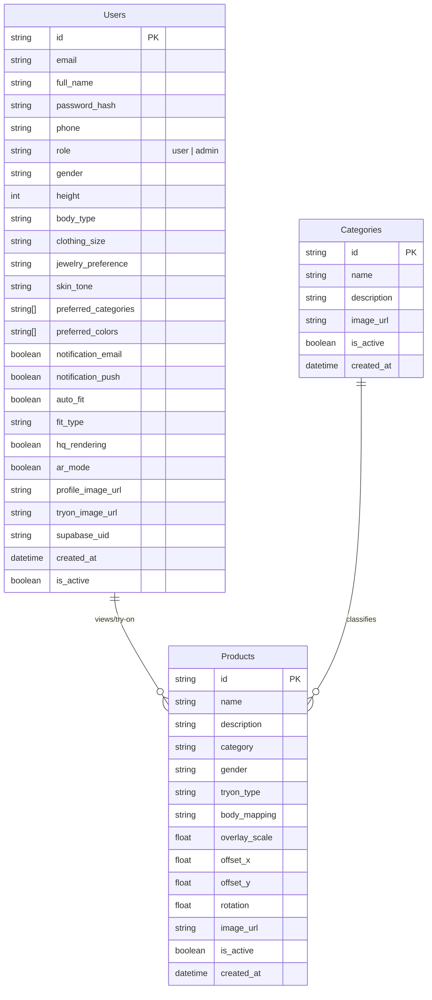
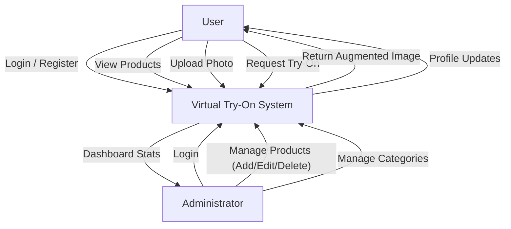

# Virtual Try-On Project Documentation

# Data Models

## ER Diagram

The following Entity-Relationship Diagram represents the data structure for the Virtual Try-On application.

## Data Dictionary

### Users Table
Stores customer and administrator information and preferences.

| Field Name | Data Type | Key | Description |
|:---|:---|:---|:---|
| `id` | String | PK | Unique identifier for the user. |
| `email` | String | Unique | User's email address (used for login). |
| `password` | String | | Hashed password for authentication. |
| `full_name` | String | | User's full display name. |
| `role` | String | | Authorization role (`user` or `admin`). Default is `user`. |
| `gender` | String | | User's gender for recommendations. |
| `height` | Integer | | User's height in cm. |
| `body_type` | String | | User's body type description. |
| `clothing_size` | String | | Preferred clothing size (e.g., S, M, L). |
| `skin_tone` | String | | Skin tone for better rendering. |
| `tryon_image_url`| String | | URL of the user's uploaded photo for virtual try-on. |
| `is_active` | Boolean | | Account status flag. |

### Products Table
Stores catalog information for items available for virtual try-on.

| Field Name | Data Type | Key | Description |
|:---|:---|:---|:---|
| `id` | String | PK | Unique identifier for the product. |
| `name` | String | | Display name of the product. |
| `category` | String | FK | Category the product belongs to (e.g., Top, Bottom). |
| `gender` | String | | Target gender (Men, Women, Unisex). |
| `image_url` | String | | URL of the product image. |
| `tryon_type` | String | | Type of try-on (Upper body, Lower body, etc.). |
| `overlay_scale` | Float | | Scaling factor for AR overlay. |
| `offset_x` | Float | | Horizontal offset for alignment. |
| `offset_y` | Float | | Vertical offset for alignment. |

### Categories Table
Classifies products into logical groups.

| Field Name | Data Type | Key | Description |
|:---|:---|:---|:---|
| `id` | String | PK | Unique identifier for the category. |
| `name` | String | | Name of the category (e.g., Casual, Formal). |
| `description` | String | | Optional description of the category. |
| `image_url` | String | | Representative image for the category. |

## Table Relationship

### Users and Products
*   **Relationship**: Indirect Many-to-Many (Conceptual).
*   **Description**: A user can try on multiple products, and a product can be tried on by multiple users. This interaction is typically captured in session data or a `TryOnHistory` table (implied).

### Categories and Products
*   **Relationship**: One-to-Many.
*   **Description**: A single Category (e.g., "Dresses") contains multiple Products. Each Product belongs to one specific Category.

---

# Process Model

## Context Analysis Diagram (Level 0 DFD)

This diagram illustrates the high-level interaction between external entities (User, Administrator) and the Virtual Try-On System.

## Modular Description

The system is divided into three primary modules, each responsible for specific functional areas.

### User Module
Handles all consumer-facing functionalities.
*   **Authentication**: Secure login, registration, and password recovery.
*   **Profile Management**: managing personal details, body measurements, and preferences.
*   **Browsing**: Viewing available products and categories.
*   **Product Interaction**: Selecting items for try-on.

### Virtual Try-On Module (Core)
The specific engine for processing images.
*   **Image Processing**: Handles uploading and resizing of user photos.
*   **AR/Overlay Logic**: Applies the clothing item onto the user's photo based on body mapping points.
*   **Rendering**: Generates the final "try-on" image for the user to view.

### Administrator Module
Provides control over the system's content.
*   **Dashboard**: View system statistics (user count, active products).
*   **Product Management**: CRUD operations for clothing items, including defining try-on parameters (scale, offset).
*   **Category Management**: Organizing products into collections.

---

# Presentation Slides

## Title Slide
**Title:** Virtual Try-On System
**Subtitle:** Revolutionizing E-Commerce with Augmented Reality
**Presented by:** [Your Name/Team Name]

## Project Overview
**Objective:**
To build an interactive mobile application that allows users to virtually try on clothing using their own photos.

**Key Features:**
*   **User Profiles:** Personalized body measurements and preferences.
*   **Virtual Try-On:** Realistic AR overlay of clothing on user photos.
*   **Admin Dashboard:** Comprehensive management of products and users.
*   **Secure Authentication:** Role-based access (User/Admin).

## Problem Statement
**The Challenge:**
*   High return rates in online fashion retail due to poor fit.
*   Inability to visualize how clothes look on one's specific body type.
*   Lack of interactive engagement in traditional e-commerce apps.

**The Solution:**
*   A "Try-Before-You-Buy" digital experience.
*   Sizing recommendations based on user data.
*   Visual confirmation reducing uncertainty and returns.

## System Architecture
**Frontend:**
*   **Framework:** React Native (Expo)
*   **Platform:** Cross-platform (iOS/Android)
*   **UI/UX:** NativeWind (Tailwind CSS) for styling.

**Backend:**
*   **Language:** Python (FastAPI)
*   **Database:** Supabase (PostgreSQL)
*   **Storage:** Supabase Storage (for images)

**Core Tech:**
*   **Augmented Reality:** Custom overlay logic (scaling, rotation, mapping).
*   **Security:** JSON Web Tokens (JWT).

## Data Models Overview
**Core Entities:**
*   **Users:** Stores profile data, measurements, and preferences.
*   **Products:** Catalog of items with specific AR parameters (scale, offset).
*   **Categories:** Organizational hierarchy for products.

## Process Flow
**User Journey:**
*   **Sign Up/Login:** Create a profile with body metrics.
*   **Browse:** Select a category and product.
*   **Upload:** Take or upload a full-body photo.
*   **Try-On:** System overlays product on user image.
*   **Result:** View and save the generated look.

## Admin Features
**Management Capabilities:**
*   **Dashboard:** Real-time statistics.
*   **Product Control:** Add new inventory, adjust AR settings.
*   **User Management:** Monitor user activity.

## Future Enhancements
*   **3D Modeling:** Upgrade from 2D overlay to full 3D cloth simulation.
*   **AI Recommendations:** Machine learning suggestions based on style and body type.
*   **Social Sharing:** Direct sharing of try-on looks to social media.

## Conclusion
The Virtual Try-On System bridges the gap between physical and digital shopping, providing a confidence-boosting tool for users and a value-driving feature for retailers.

**Thank You!**
**Q&A**
