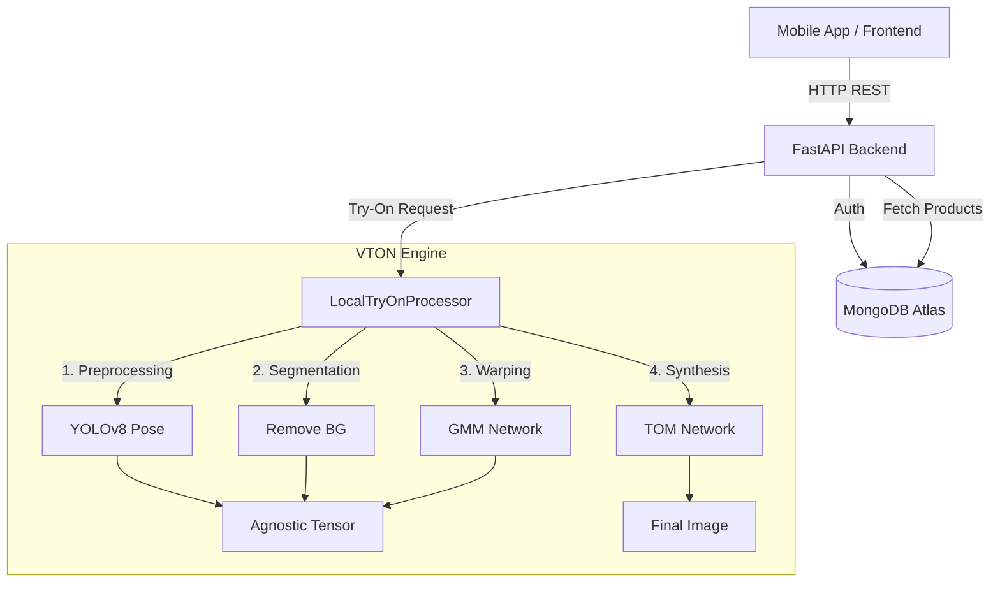

# Virtual Try-On Backend Documentation

## 1. Overview
The backend is a **FastAPI** application that provides a comprehensive API for the Virtual Try-On mobile application. It handles user authentication, product management, and performs **locally executed Virtual Try-On** using a deep learning pipeline (CP-VTON+) accelerated by **YOLOv8** pose estimation.

**Core Technologies:**
*   **Framework:** FastAPI (Python)
*   **Database:** MongoDB (via Motor/Pymongo)
*   **Authentication:** JWT (JSON Web Tokens)
*   **Try-On Engine:** PyTorch (CP-VTON+) + YOLOv8 (Ultralytics) + Rembg

## 2. Architecture



## 3. Local Virtual Try-On Engine (`local_tryon.py`)
This is the heart of the system, running entirely on the local CPU (or GPU if available). It replaces external APIs with a private, zero-cost solution.

### Pipeline Steps:
1.  **Input:** Receives User Image and Garment Image.
2.  **Preprocessing:**
    *   **Resizing:** Both images resized to 192x256 (standard CP-VTON resolution).
    *   **Pose Estimation (YOLOv8):** Detects 17 body keypoints (Shoulders, Elbows, Hips, etc.) to understand the user's posture.
    *   **Segmentation (Rembg):** Removes background to create a precise body shape mask.
    *   **Agnostic Tensor:** Constructs a 22-channel tensor representing the user's body *without* the upper clothes (Head + Shape + Pose).
3.  **GMM (Geometric Matching Module):**
    *   Warps the flat garment image to align with the user's body pose and shape.
4.  **TOM (Try-On Module):**
    *   Fuses the warped garment with the user's body, preserving skin texture and face details while applying the new cloth.
5.  **Output:** Returns the synthesized image as bytes.

## 4. API Endpoints

### Authentication
*   `POST /api/auth/signup`: Check generic/admin signup.
*   `POST /token`: Login to get JWT access token.

### Virtual Try-On
*   `POST /api/tryon/process`:
    *   **Input:** `user_image` (File), `product_id` (String).
    *   **Process:** Validates images -> Fetches product -> Runs VTON Engine.
    *   **Output:** Base64 encoded result image.

### Admin/Management
*   `GET /admin/stats`: System statistics (User count, Product count).
*   `GET /admin/users`: List all users.
*   `DELETE /admin/users/{id}`: Delete a user.

## 5. Setup & Running

# Installation
1.  **Clone Repository** & Navigate to `backend/`.
2.  **Install Dependencies:**
    ```bash
    pip install -r requirements.txt
    ```
    *(Includes torch, torchvision, opencv-python, ultralytics, rembg, fastapi, uvicorn)*

3.  **Model Setup:**
    *   Ensure `backend/local_vton/checkpoints/` contains:
        *   `GMM/gmm_final.pth`
        *   `TOM/tom_final.pth`
    *   `yolov8n-pose.pt` will download automatically on first run.

# Running the Server
```bash
python -m uvicorn main:app --reload --host 0.0.0.0
```
*   **Host:** `0.0.0.0` makes it accessible to mobile apps on the same network.
*   **Port:** Defaults to `8000`.

## 6. File Structure
*   `main.py`: Entry point, API routes, App configuration.
*   `local_tryon.py`: The VTON engine wrapper (YOLO + CP-VTON logic).
*   `local_vton/`: The deep learning network definitions (`networks.py`, `cp_dataset.py`).
*   `requirements.txt`: Python package list.
